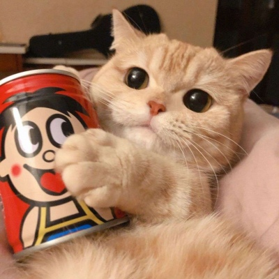

    
    
 Xiaoyu Pang 
 
    

    📍 Shenzhen,China &nbsp&nbsp&nbsp&nbsp&nbsp&nbsp&nbsp&nbsp&nbsp&nbsp&nbsp&nbsp&nbsp&nbsp&nbsp&nbsp&nbsp&nbsp&nbsp&nbsp&nbsp&nbsp&nbsp&nbsp&nbsp&nbsp&nbsp&nbsp&nbsp&nbsp&nbsp&nbsp  
    💌 <a href=mailto:xiaoyu_pang@qq.com>xiaoyu_pang@qq.com </a>&nbsp&nbsp&nbsp&nbsp&nbsp&nbsp&nbsp&nbsp&nbsp&nbsp&nbsp&nbsp&nbsp&nbsp &nbsp&nbsp&nbsp     
    🐵 <a href="https://github.com/xiaoyupang" target="_blank"> https://github.com/xiaoyupang</a>
   

<h6>作品一 </h6>

    <h1 align="center">Web PC版 网易云音乐 </h1>
    
 基于React，   
        👀<a href="http://18.218.243.114:7000/" target="_blank">预览 </a>，
        👉<a href="https://github.com/xiaoyupang/netease-cloud-music"target="_blank" >GitHub</a>
    

    

        
        
        
    

    
    

<h6> 作品二</h6>

    <h1 align="center">Raspberry Pi 智能家居监控系统 </h1>
    
  🐍Python & Django，🍇树莓派，
        👉<a href="https://github.com/xiaoyupang/raspi"target="_blank" >GitHub</a>
    

    
    

